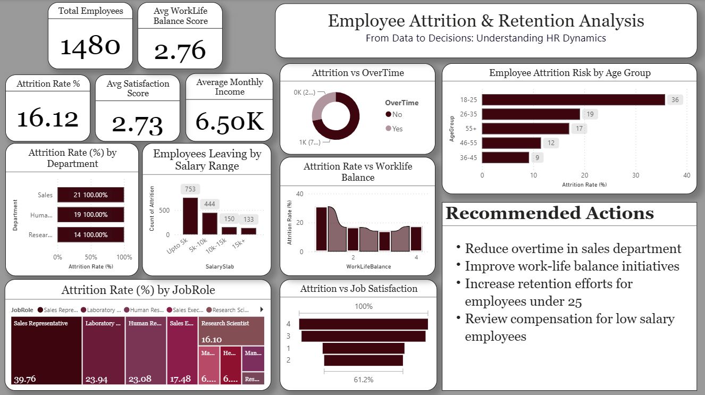

# Early Attrition Risk Analysis — HR Insights

This project analyzes employee attrition data with a focus on **early-stage attrition (employees leaving within the first 12 months)**.
The goal is to identify high-risk roles and departments where early exits result in unrecovered hiring and onboarding costs.

## Objective
- Measure overall and early attrition rates
- Identify roles and departments with higher early attrition
- Support data-driven HR decisions related to hiring, onboarding, and retention

## Tools Used
- Microsoft Excel
- Power BI

## Key Metrics (from dashboard)
- **Overall Attrition Rate**: 16.12%
- **Total Employees**: 1,480
- **Average Monthly Income**: 6.50K
- **Avg Work-Life Balance Score**: 2.76
- **Avg Job Satisfaction Score**: 2.73

## Key Insights
- **Age is the strongest attrition risk factor** — the 18-25 age group has by far the highest attrition rate (36%), more than any other age bracket
- **Sales Representative** is the highest-risk job role, with an attrition rate of ~39.76% — well above every other role
- Attrition is concentrated in **lower salary slabs**: employees earning up to ₹5K account for the largest share of exits (753 cases), dropping sharply as salary increases
- Sales and Human Resources departments show the highest attrition rates among all departments
- Overtime and work-life balance both show a visible relationship with attrition, though age and role remain the dominant factors

## Recommended Actions (from dashboard)
- Reduce overtime in the Sales department
- Improve work-life balance initiatives
- Increase retention efforts specifically for employees under 25
- Review compensation for low-salary employees

## Output
- Interactive Power BI dashboard
- PDF project summary

## Files
- `hr-attrition-dashboard.pbix` — Power BI report file (open in Power BI Desktop)
- `hr-attrition-dashboard.png` — dashboard screenshot
- `hr-attrition-data.xlsx` — source HR dataset
- `hr-attrition-report.pdf` — PDF summary of findings

## Author
Khushi Sharma
